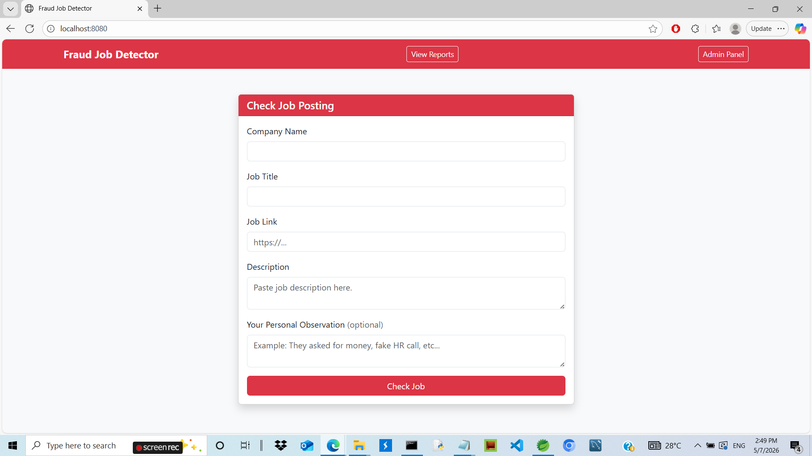
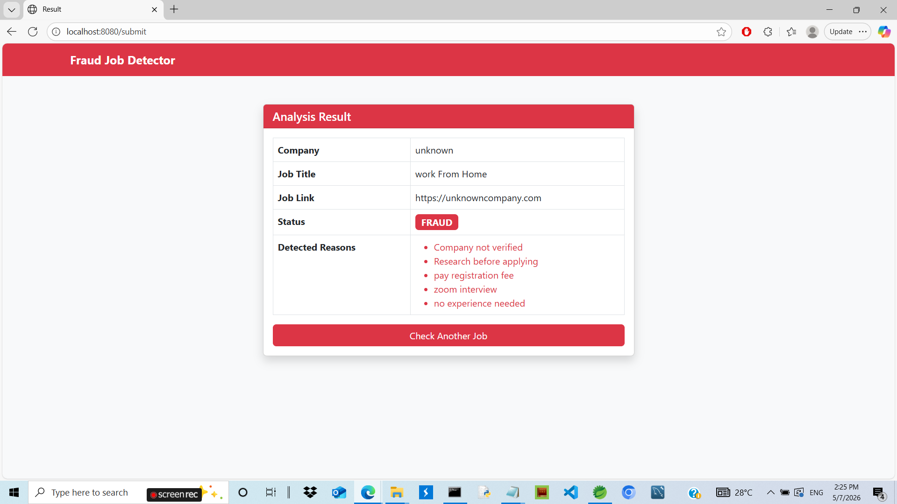
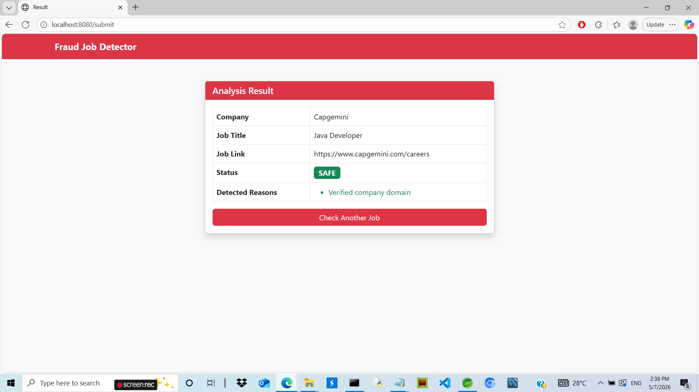
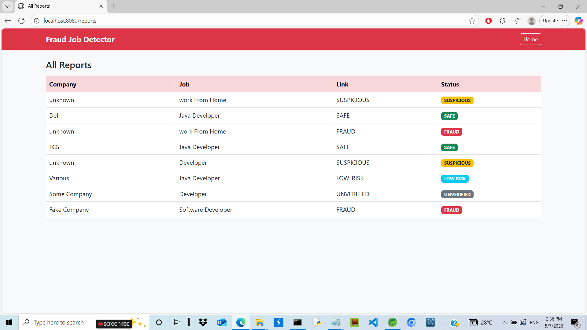
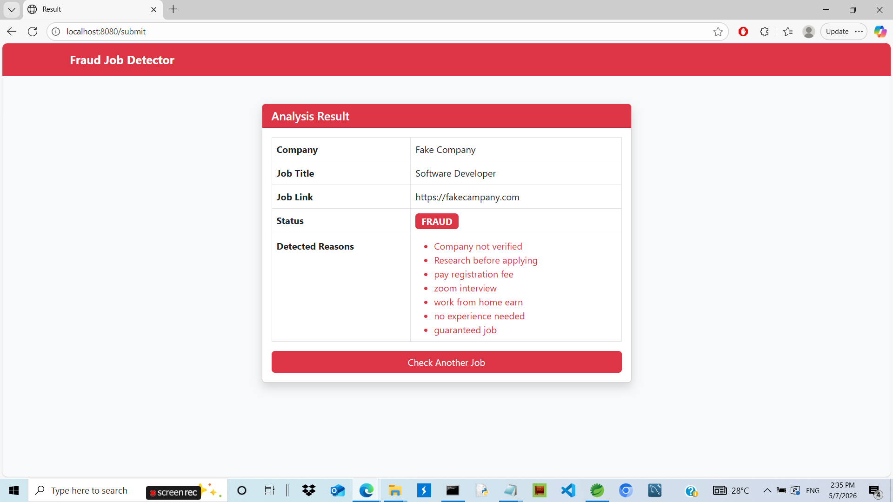

# Fraud Job Detector 🔍

A full-stack web application built with Java Spring Boot 
that helps users identify fraudulent job postings before applying.

## 💡 Motivation
I personally experienced a job fraud where someone called 
me on Zoom and asked for a registration fee. That real 
experience motivated me to build this system to help 
others avoid similar scams.

## 🎯 Features
- **URL Analysis** — checks if job link is from trusted domain
- **Description Scanner** — detects fraud keywords like 
  "registration fee", "zoom interview", "no experience needed"
- **Multi-layer Detection** — combines URL + description analysis
- **Explainable Results** — shows exactly WHY a job is flagged
- **Admin Panel** — manage and review all reports
- **Color Coded Status** — FRAUD, SUSPICIOUS, SAFE, UNVERIFIED

## 🚨 Risk Levels
| Status | Meaning |
|--------|---------|
| 🔴 FRAUD | Confirmed fraudulent patterns detected |
| 🟡 SUSPICIOUS | Multiple warning signs found |
| 🔵 LOW RISK | Posted on trusted job portal |
| 🟢 SAFE | Official company website |
| ⚪ UNVERIFIED | Company not in database — verify independently |

## 🛠️ Tech Stack
| Layer | Technology |
|-------|-----------|
| Backend | Java, Spring Boot |
| Database | MySQL, Spring Data JPA |
| Frontend | Thymeleaf, Bootstrap 5 |
| APIs | REST APIs |
| Tools | STS, Postman, Git |

## 📸 Screenshots

### Home Page


### Fraud Detection Result


### Safe Job Result


### Reports Page


### Real Scam Detection (Zoom Scam)


## 🔍 How It WorksUser submits job link + description
↓
URL Analyzer checks domain trust
↓
Description Scanner checks fraud keywords
↓
Combined status calculated
↓
Result shown with reasons
↓
Saved to database## 🚀 Fraud Detection Logic

### URL Analysis:
- Social media links → SUSPICIOUS
- Trusted portals (Naukri, LinkedIn) → LOW RISK  
- Official company domains → SAFE
- Known fraud domains (blogspot, wordpress) → FRAUD
- Unknown domains → UNVERIFIED

### Description Scanning:
- 1 fraud keyword → WARNING
- 2 fraud keywords → SUSPICIOUS
- 3+ fraud keywords → FRAUD

### Fraud Keywords Detected:
- "pay registration fee"
- "zoom interview"
- "no experience needed"
- "work from home earn"
- "guaranteed job"
- "whatsapp only"
- and more...

## ⚙️ Setup Instructions

### Prerequisites:
- Java 17
- MySQL
- Maven

### Steps:
```bash
# Clone repository
git clone https://github.com/ganeshgadmur/fraud-job-detector.git

# Configure database
# Edit src/main/resources/application.properties
spring.datasource.url=jdbc:mysql://localhost:3306/frauddb
spring.datasource.username=root
spring.datasource.password=yourpassword

# Run project
./mvnw spring-boot:run

# Access application
http://localhost:8080
```

## 📊 Database Schema
```sql
CREATE TABLE job_reports (
    id BIGINT AUTO_INCREMENT PRIMARY KEY,
    company_name VARCHAR(255),
    job_title VARCHAR(255),
    job_link VARCHAR(255),
    description TEXT,
    reported_reason TEXT,
    detected_reasons TEXT,
    status VARCHAR(50)
);
```

## 🔮 Future Scope
- MCA/ROC API integration for official company verification
- User reports counter with auto-flagging
- Fraud confidence score system
- JWT Authentication for admin panel
- Email alerts for high-risk job postings

## 👨‍💻 Author
Ganesh Gadmur
- GitHub: [@ganeshgadmur](https://github.com/ganeshgadmur)
